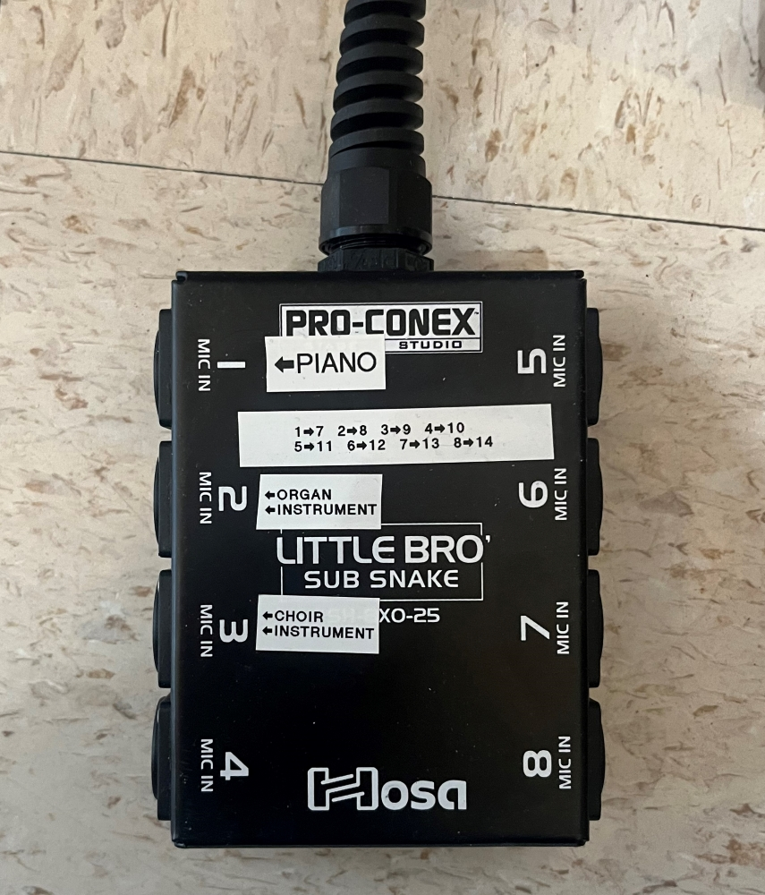

# Connecting and Using Microphones

## Introduction
This article provides detailed information on the microphones and ports available in Mackey Hall, as well as instructions for connecting them and adjusting their levels.

---

## Microphone Storage
  Microphones can be found either in the second drawer from the bottom on the sound system rack or on the top shelf inside the pulpit.
   
   

## Microphones
  Mackey Hall offers various types of microphones for different purposes. Here are the details:

### Pulpit Microphone
  The pulpit microphone is specifically designed to plug into the pulpit. It connects to one of the two ports on the wall beneath the projector screen, using a cable stored in the top corner of the pulpit. Usually, this microphone is kept in the sound system rack drawer or on the pulpit.
   

### Wireless Clip-on Lapel Microphone
  The lapel microphone is a wireless clip-on microphone that requires batteries. Please notify the Pastor or Church Office if the batteries need replacement.
   

### Handheld Wireless Microphone
  The handheld microphone is a wireless handheld microphone that also requires batteries. Please inform the Pastor or Church Office if the batteries need replacement.

### Plug-in Microphones
  There are three other plug-in microphones available. All three are specifically designed for instrumentsand are stored in protective bags. There is an audio snake located under the heater along the wall between the organ and piano in Mackey Hall.
   
   

## Master Fader
  In Master Fader, the differt microphones are labelled along the bottom.

### Pulpit Microphone
  The pulpit microphone ports correspond to channels 1 and 2 in Master Fader. If you use the top port, it will be channel 1, and if you use the bottom port, it will be channel 2 in Master Fader.
   

### Wireless Clip-on Lapel Microphone
  The lapel microphone corresponds to channel 3.
   

### Handheld Wireless Microphone
  The handheld microphone corresponds to channel 4.
   

### Plug-in Microphones
  
The cable snake labels each port and its corresponding channel in Master Fader. Please refer to the labels on the cable snake to identify the specific ports and their corresponding channels in Master Fader.
 

## Changing Audio Levels
  To adjust the audio levels, move the slider to the desired level. It is recommended to have some noise in the microphone while making adjustments and start with a lower position on the slider dial.

## Muting / Unmuting
  To mute or unmute, click the mute button located at the top of the sliders. The button will appear orange when muted and white when unmuted.
   